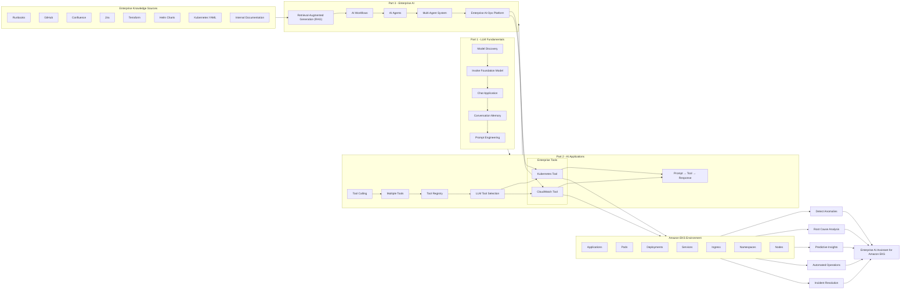

# Roche-SRE_AIOPS_EU_20thjuly2026

# Enterprise AI for Amazon EKS - Learning & Architecture Roadmap



## End Goal

**Enterprise AI Assistant**

- Build an intelligent AI assistant for Amazon EKS.
- Use **LLMs** for reasoning and natural language interaction.
- Integrate **Tool Calling** to perform Kubernetes and AWS operations.
- Use **RAG** to retrieve enterprise knowledge from internal documentation.
- Implement **AI Agents** to automate complex operational workflows.
- Evolve into a complete **AI-Ops Platform** capable of:
  - Detecting anomalies
  - Predicting failures
  - Performing root cause analysis
  - Recommending remediations
  - Executing automated operational tasks
  - Managing enterprise Kubernetes environments intelligently


# Enterprise AI Workflow for Amazon EKS

```text
                               User / SRE / DevOps Engineer
                                          │
                                          ▼
                                 Natural Language Query
                                          │
                                          ▼
                               Enterprise AI Assistant
                                          │
                                          ▼
                                   Conversation Memory
                                          │
                             ┌────────────┴────────────┐
                             │                         │
                             ▼                         ▼
                    Previous Context?            No Previous Context
                             │                         │
                             └────────────┬────────────┘
                                          ▼
                               Need Enterprise Knowledge?
                                          │
                        ┌─────────────────┴─────────────────┐
                        │                                   │
                       No                                  Yes
                        │                                   │
                        │                          Enterprise RAG
                        │                                   │
                        │                    ┌──────────────┼──────────────┐
                        │                    │              │              │
                        │                    ▼              ▼              ▼
                        │                Runbooks      GitHub Repo    Confluence
                        │                    │
                        │                    ▼
                        │               Jira / Helm
                        │                    │
                        │                    ▼
                        │            Kubernetes YAML
                        │                    │
                        └──────────────┬─────┘
                                       ▼
                            Need External Action?
                                       │
                    ┌──────────────────┴──────────────────┐
                    │                                     │
                   No                                    Yes
                    │                                     │
                    ▼                                     ▼
            Generate Answer                      Tool Selector (LLM)
                                                        │
                        ┌───────────────────────────────┼──────────────────────────────┐
                        │                               │                              │
                        ▼                               ▼                              ▼
                 Kubernetes Tool                 CloudWatch Tool                 AWS Tool
                        │                               │                              │
                        ▼                               ▼                              ▼
                 Get Pods/Logs                 Metrics/Alarms                 AWS Services
                        │                               │                              │
                        └───────────────┬───────────────┴───────────────┬──────────────┘
                                        ▼
                                Execute Operations
                                        │
                                        ▼
                                  Tool Response
                                        │
                                        ▼
                              Final LLM Reasoning
                                        │
                                        ▼
                          AI Agent / Workflow Decision
                                        │
                  ┌─────────────────────┼─────────────────────┐
                  │                     │                     │
                  ▼                     ▼                     ▼
           Detect Anomaly        Root Cause Analysis    Predict Failure
                  │                     │                     │
                  └─────────────────────┼─────────────────────┘
                                        ▼
                               Save Conversation Memory
                                        │
                                        ▼
                         Intelligent Response to the User
```

## Enterprise AI Goal

**Question → Memory → RAG → Tool Selection → Kubernetes/AWS → AI Reasoning → AI Agent → Prediction → Memory → Intelligent Response**

This architecture gradually evolves from a simple chatbot into an **Enterprise AI-Ops Platform** capable of:
- Understanding user intent
- Remembering previous conversations
- Retrieving enterprise knowledge using RAG
- Calling Kubernetes and AWS tools
- Performing intelligent reasoning with LLMs
- Detecting anomalies
- Predicting incidents before failures occur
- Executing automated operational workflows on Amazon EKS