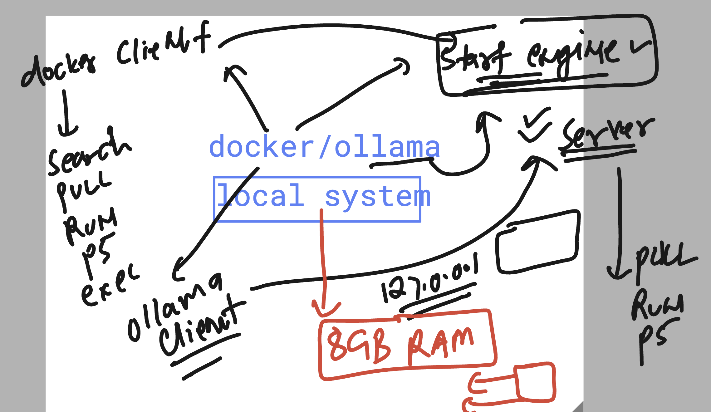

### understanding ollama 



### ollam commands 

### start server

```
ollama serve


===> client 

umanfirmware@darwin  ~  ollama  list                 
NAME                  ID              SIZE      MODIFIED      
llama3.2:1b           baf6a787fdff    1.3 GB    5 hours ago      
smollm:135m           b0b2a4617438    91 MB     6 hours ago      
deepseek-v2:latest    7c8c332f2df7    8.9 GB    17 months ago    
 humanfirmware@darwin  ~  
 humanfirmware@darwin  ~  
 humanfirmware@darwin  ~  ollama  pull  kimi-k3:cloud
pulling manifest 
verifying sha256 digest 
writing manifest 
success 
 humanfirmware@darwin  ~  ollama  list               
NAME                  ID              SIZE      MODIFIED      
kimi-k3:cloud         630e737485bd    -         3 seconds ago    
llama3.2:1b           baf6a787fdff    1.3 GB    5 hours ago      
smollm:135m           b0b2a4617438    91 MB     6 hours ago      
deepseek-v2:latest    7c8c332f2df7    8.9 GB    17 months ago   

===

 humanfirmware@darwin  ~  ollama run llama3.2:1b
>>> 
>>> 
>>> hey
Hello. Is there something I can help you with or would you like to chat?

>>> write code of  python to print 10 times hello world 
To print "Hello World" 10 times in Python, you can use a simple loop that runs 10 times. Here's how you can do it:

```python
# Print Hello World 10 times
for i in range(1, 11):
    print("Hello World", end=" ")
print()


 ollama ps
NAME           ID              SIZE      PROCESSOR    CONTEXT    UNTIL              
llama3.2:1b    baf6a787fdff    1.5 GB    100% GPU     4096       4 minutes from now    
 humanfirmware@darwin  ~  


```


