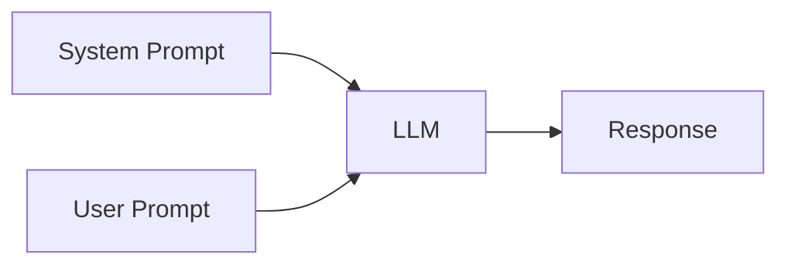

# Prompt Engineering

## Learning Objective

By the end of this module, students should understand:

- What a prompt is
- Prompt lifecycle
- Prompt components
- User prompt
- System prompt
- Prompt engineering techniques
- Prompt optimization
- Prompt templates
- Prompt variables
- Prompt management
- Token optimization

## Flow

```text
What is Prompt?

↓

Prompt Components

↓

User Prompt

↓

System Prompt

↓

Prompt Parameters

↓

Prompt Engineering Techniques

↓

Prompt Optimization

↓

Prompt Management

↓

Prompt Templates

↓

Real-world Examples
```

## 1. What Is a Prompt?

A prompt is an instruction given to an LLM that tells it what to do.

### Components Example

Bad prompt:

```text
Docker
```

Good prompt:

```text
Explain Docker to a beginner in less than 100 words.
```

## 2. Components of a Prompt

AWS describes a prompt as being made up of multiple logical components rather than just a question.

I teach this diagram:

```text
Prompt

┌───────────────────────┐
Task / Instruction
Context
Role
Constraints
Input
Output Format
Examples
Tone
Audience
└───────────────────────┘
```

### User Prompt Example

- **Role:** You are an AWS Solution Architect.
- **Task:** Explain Amazon EKS.
- **Audience:** Beginner.
- **Constraint:** Maximum 100 words.
- **Output:** Bullet points.

## 3. User Prompt

This is the simplest prompt.

### System Prompt Example

```text
Explain Docker.
```

The LLM decides everything.

### Better User Prompt

```text
Explain Docker to a beginner.

Maximum 100 words.

Use simple English.

Use bullet points.
```

Now compare outputs. Students immediately see the improvement.

## 4. System Prompt

This is where things become interesting.

The user prompt asks the question, while the system prompt controls model behavior.

### Prompt Parameter Example

Without system prompt:

```text
Explain Docker.
```

Output:

```text
Random style.
```

With system prompt:

```text
You are a Senior DevOps Engineer.

Always answer using:

Overview
Architecture
Advantages
Disadvantages
Interview Questions

Maximum 200 words.
```

Now ask:

```text
Explain Docker.
```

Students immediately see the same question produce a different answer.

### Mermaid



## 5. Prompt Parameters

Students already know:

- Temperature
- Top P
- Max Tokens

Now explain:

```text
Prompt

+

Parameters

↓

LLM

↓

Response
```

### Optimization Example

- Temperature 0: consistent
- Temperature 1: creative

```text
I know Docker.

I know Kubernetes.

Explain Amazon EKS compared with self-managed Kubernetes.
```

### Output Formatting

Instead of:

```text
Explain Docker.
```

Use:

- Return response as JSON
- Markdown table
- CSV
- Bullet points

This becomes extremely useful later.

### Constraints

Examples:

- Answer in 100 words.
- Answer in one sentence.
- Use only bullet points.
- Maximum five points.
- Explain like a 10 year old.
- Don't use technical words.
- Don't explain Kubernetes.
- Only explain Docker.

Students learn:

```text
Prompt -> Controls Cost -> Controls Tokens -> Controls Quality
```

AWS also recommends giving clear instructions, specifying output format, and using inference parameters such as `maxTokens` to control response length.

## Prompt Optimization

Show a bad prompt:

```text
Tell me about AWS.
```

Then show a better prompt:

```text
You are an AWS Certified Solutions Architect.

Explain Amazon EKS.

Target audience: Beginner.
Maximum 100 words.
Use bullet points.
Include one example.
Do not discuss ECS.
```

AWS Bedrock even provides Prompt Management and Prompt Optimization features to help refine prompts and compare prompt variants.

## Prompt Templates

Instead of writing prompts repeatedly:

```text
You are a {{role}}

Explain {{topic}}

Maximum {{words}}

Output {{format}}
```

Later you’ll show how variables make prompts reusable.

## Real-world Examples

Instead of theory, let students improve prompts.

### Real-world Example 1

```text
Explain Docker.
```

Students improve it.

### Real-world Example 2

```text
Create Terraform code.
```

Students improve it.

### Real-world Example 3

```text
Summarize logs.
```

Students improve it.

## The Most Important Lesson

I would end the session with this diagram.

```text
Bad Prompt
      │
      ▼
Bad Response

Good Prompt
      │
      ▼
Good Response

Excellent Prompt
      │
      ▼
Excellent Response
```