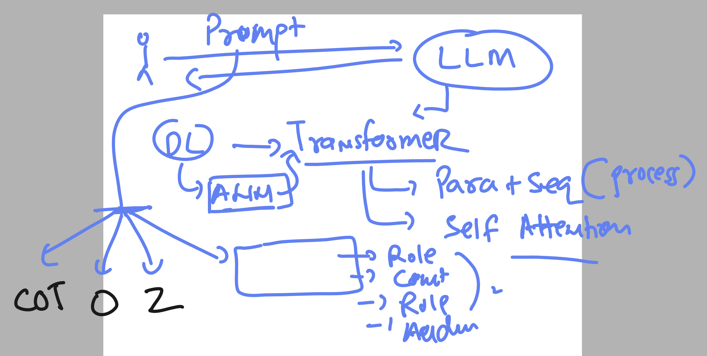
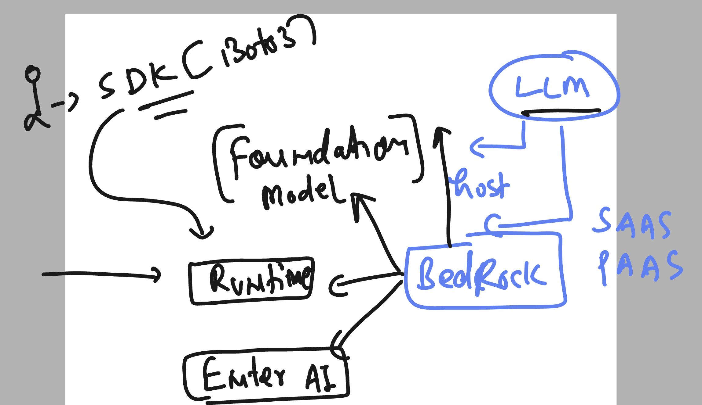
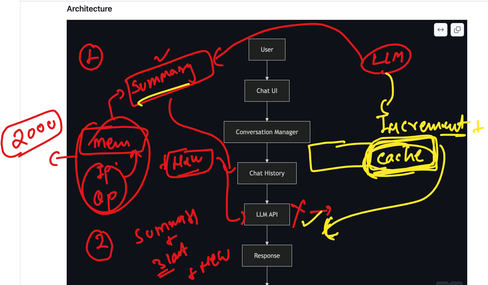
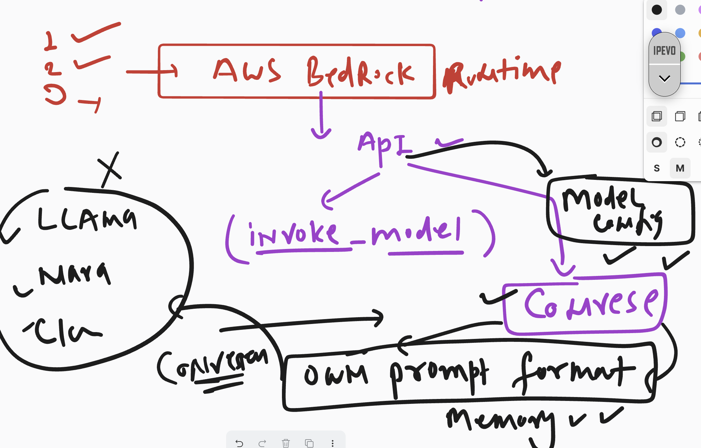
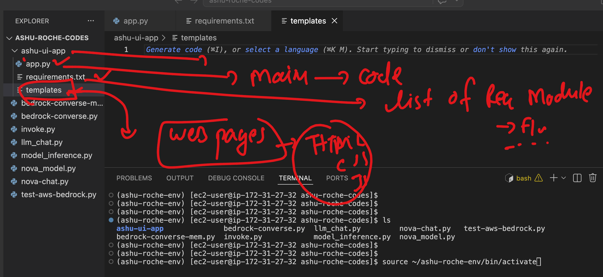

# Roche-SRE_AIOPS_EU_20thjuly2

## Revision 



### Revsion new 



### chatapp with LLM and conversation Memomry 



### understanding aws-bedrock conversation API 



## python flask ui app 



### running flask UI app

```
(ashu-roche-env) [ec2-user@ip-172-31-27-32 ~]$ cd ashu-roche-codes/ashu-ui-app/
(ashu-roche-env) [ec2-user@ip-172-31-27-32 ashu-ui-app]$ ls
app.py  requirements.txt  templates

 pip3 install -r requirements.txt

 python3 app.py 
 * Serving Flask app 'app'
 * Debug mode: on
WARNING: This is a development server. Do not use it in a production deployment. Use a production WSGI server instead.
 * Running on all addresses (0.0.0.0)
 * Running on http://127.0.0.1:5000
 * Running on http://172.31.27.32:5000
Press CTRL+C to quit
 * Restarting with stat
 * Debugger is active!

```
