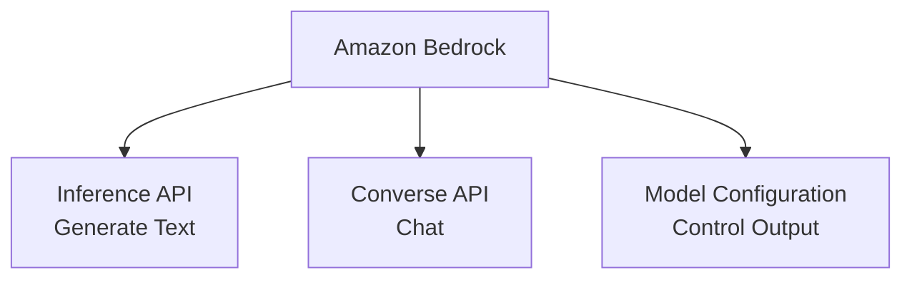
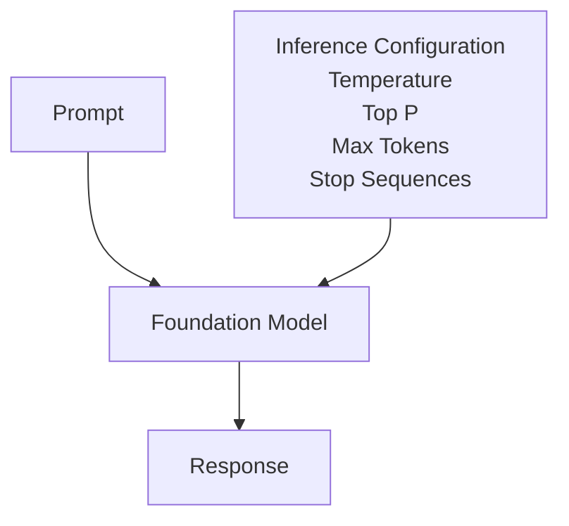
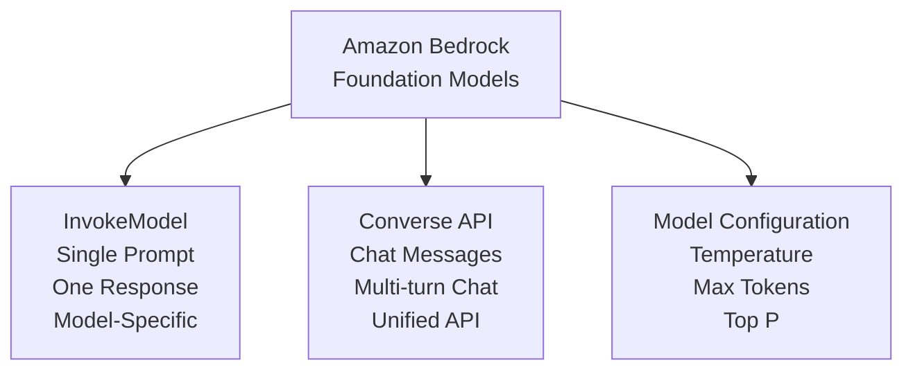

# Amazon Bedrock APIs

Amazon Bedrock usage can be understood as three parts:

- Inference API (`InvokeModel`) for direct, model-specific inference
- Converse API for chat-style, multi-turn interactions
- Model Configuration (inference parameters) to control output behavior



## 1. Inference API (`InvokeModel`)

This is the basic inference API.

You send a prompt to a model, and the model returns a response.

### Flow

```mermaid
flowchart TD
    A[Application] --> B[InvokeModel()]
    B --> C[Foundation Model]
    C --> D[Generated Response]
```

### Python Example

```python
response = client.invoke_model(
    modelId=MODEL_ID,
    body=json.dumps(body),
    contentType="application/json"
)
```

### Request Pattern

Prompt -> Model -> Response

### Characteristics

- Simple request/response
- Good for single prompts
- Model-specific request format
- Useful for text generation, summarization, translation, embeddings, image generation, and more
- Each model may require slightly different parameters and prompt structure

### When to Use `InvokeModel`

- Text summarization
- Translation
- Email generation
- SQL generation
- JSON generation
- Code generation

Example:

Summarize the following incident... -> Summary

## 2. Converse API

AWS introduced the Converse API to simplify conversational applications.

Instead of manually crafting a prompt for each model format, you send structured messages. AWS handles model-specific formatting where needed.

### Flow

```mermaid
flowchart TD
    A[Messages] --> B[Converse()]
    B --> C[Foundation Model]
    C --> D[Assistant Message]
```

### Message Format (instead of `prompt="..."`)

```python
messages = [
    {
        "role": "user",
        "content": [
            {
                "text": "Explain Kubernetes"
            }
        ]
    }
]
```

### Advantages

- Unified API across supported models
- Works across providers (for example: Claude, Meta, Nova, Mistral)
- Built-in conversation support for multi-turn interactions

Conversation pattern:

User -> Assistant -> User -> Assistant -> User -> Assistant

Perfect for:

- Chatbots
- Copilots
- AI assistants
- Customer support assistants
- Enterprise assistants

### Additional Features

The Converse API supports:

- System prompts
- Conversation history
- Tool use (function calling)
- Guardrails
- Prompt management
- Streaming responses
- Common inference configuration across models

### `InvokeModel` vs `Converse`

| `InvokeModel` | `Converse` |
| --- | --- |
| Single prompt | Multi-turn chat |
| Model-specific prompt format | Unified messages API |
| Good for one-off generation | Best for chat assistants and copilots |
| Simpler | More feature-rich |
| Supports all inference tasks | Optimized for conversational applications |

## 3. Model Configuration (Inference Configuration)

The model is fixed. What changes is how the model generates responses.

This is called inference configuration (or model configuration).

Prompt + Configuration -> LLM -> Response



### Common Parameters

#### Temperature

Controls randomness.

- `0.0`: deterministic, similar answer every time
- `1.0`: more creative, more variation across responses

Example:

```text
temperature = 0
```

Best for:

- JSON output
- SQL output
- Automation workflows
- Incident reports

#### Max Tokens

Limits response length.

Example:

```text
maxTokens = 512
```

- 100 tokens -> short answer
- 4000 tokens -> long explanation

#### Top P

Controls token selection probability mass.

Example:

```text
topP = 0.9
```

- Lower values: more focused output
- Higher values: more diverse output

#### Stop Sequences

Tells the model where to stop generating.

Example:

```text
Question:
...

Answer:
...

END
```

The model stops when it reaches `END`.

### Where Parameters Are Used

#### `InvokeModel`

```json
{
  "prompt": "...",
  "temperature": 0,
  "top_p": 0.9,
  "max_gen_len": 512
}
```

#### `Converse`

```json
{
  "inferenceConfig": {
    "temperature": 0,
    "topP": 0.9,
    "maxTokens": 512
  }
}
```

The Converse API exposes a common `inferenceConfig` object (`temperature`, `topP`, `maxTokens`, `stopSequences`) across supported models. Model-specific parameters can still be supplied separately when needed.

## One-Slide Summary

