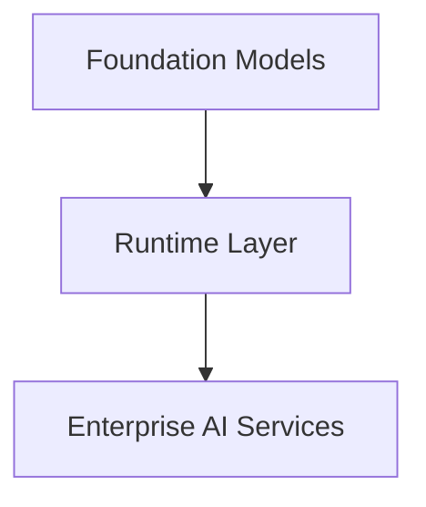

# Amazon Bedrock Architecture

## Overview



Think of it as:

- Models: the brain
- Runtime: the API you call from Python
- Enterprise services: features that help build production AI applications

## Layer 1: Foundation Models

This is the simplest layer. These are the actual LLMs.

- Amazon Titan
- Meta Llama
- Anthropic Claude
- Amazon Nova
- Mistral
- Cohere
- AI21

Example model IDs:

```text
MODEL_ID="meta.llama3-8b-instruct-v1:0"
MODEL_ID="anthropic.claude-3-5-sonnet..."
MODEL_ID="amazon.nova-pro-v1:0"
```

Bedrock does not create the models. It provides managed access to foundation models from AWS and third-party providers through a unified platform.

## Layer 2: Bedrock Runtime

This is the service you actually call in Python.

```python
client = boto3.client("bedrock-runtime")
```

Students often ask why it is called runtime: because the model is already deployed, and you are simply running inference.

### Runtime APIs

#### `InvokeModel`

The original inference API.

```python
client.invoke_model()
```

Use when:

- Single prompt
- Model-specific request format
- Simple inference

Flow:

```text
Prompt -> InvokeModel -> LLM -> Response
```

#### `Converse` Recommended

Modern chat API.

```python
client.converse()
```

Use when:

- Chatbot
- AI assistant
- Copilot
- Multi-turn conversations

Flow:

```text
Messages -> Converse -> LLM -> Messages
```

AWS recommends the Converse API for conversational applications because it provides a consistent interface across supported models and handles model-specific prompt formatting where applicable.

### Streaming

- `InvokeModelWithResponseStream()`
- `ConverseStream()`

Instead of waiting for the entire answer, you get partial output like:

```text
Hel
Hello
Hello Wo
Hello World
```

Useful for:

- ChatGPT-style UI
- Real-time typing effect

## Layer 3: Enterprise AI Services

These services build on top of the runtime.

### Prompt Management

Instead of storing prompts inside Python:

```python
prompt = """
You are SRE...
"""
```

Store prompts centrally in Bedrock and inject variables at runtime.

Useful for:

- Versioning
- Reuse
- Team collaboration

### Guardrails

Protect LLM responses.

Flow:

```text
User -> Offensive Prompt -> Guardrail -> Blocked
```

Use cases:

- PII filtering
- Toxic content
- Compliance
- Safety policies

### Knowledge Bases

Managed RAG.

Instead of:

```text
Loader -> Chunker -> Embedding -> FAISS
```

Bedrock does:

```text
Knowledge Base -> Retrieve -> Generate
```

This replaces most of the manual RAG pipeline you built earlier.

### Agents

Instead of:

```text
User -> LLM
```

Agents can follow a workflow like:

```text
User -> Reason -> Tool -> API -> Database -> LLM
```

Use cases:

- Function calling
- Workflow automation
- Multi-step reasoning

### Flows

Visual orchestration.

Instead of writing:

```text
if...
call tool...
call model...
```

You build a workflow graph:

```text
Prompt -> Model -> Tool -> Decision -> Output
```

### Model Evaluation

Compare models.

```text
Prompt -> Claude -> Score

Prompt -> Llama -> Score

Prompt -> Nova -> Score
```

Useful for:

- Accuracy
- Cost
- Latency
- Quality comparison

## Python SDK Components

### Bedrock Runtime Client

Today, you will mostly use only one client.

```python
import boto3

client = boto3.client("bedrock-runtime")
```

Used for:

- `invoke_model()`
- `converse()`
- Streaming
- Embeddings

This is the client you will use for most of your coding sessions.

### Bedrock Management Client

```python
client = boto3.client("bedrock")
```

Used for:

- List models
- Model access
- Foundation model information

Think of it as the control plane, whereas `bedrock-runtime` is the data plane that actually performs inference.

### Agents Runtime Client

```python
client = boto3.client("bedrock-agent-runtime")
```

Used later for:

- Knowledge Bases
- Retrieve
- RetrieveAndGenerate
- Agents