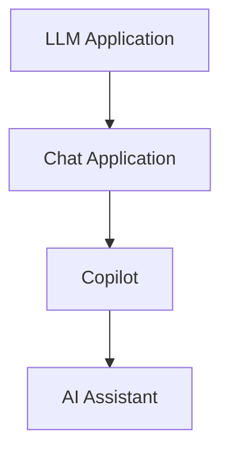
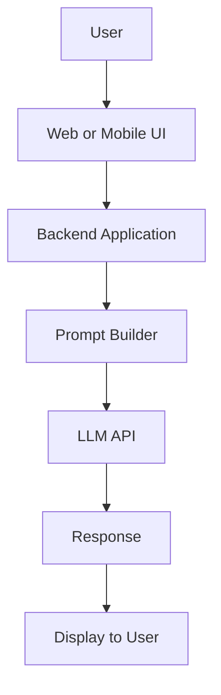
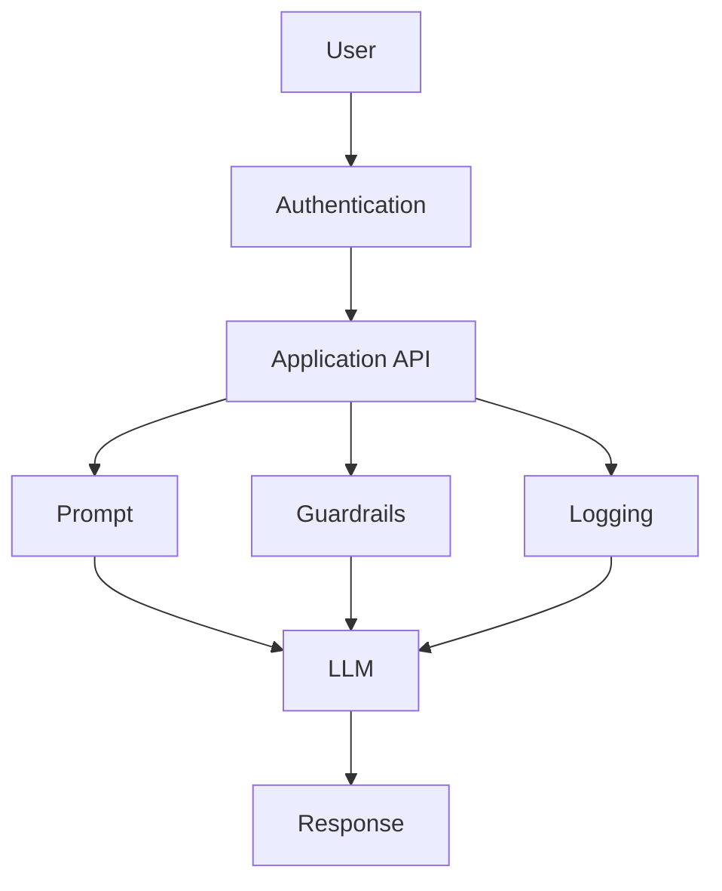
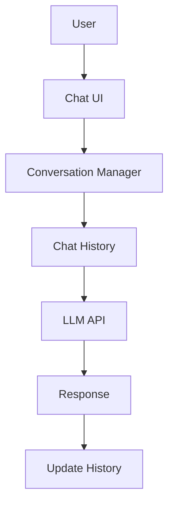
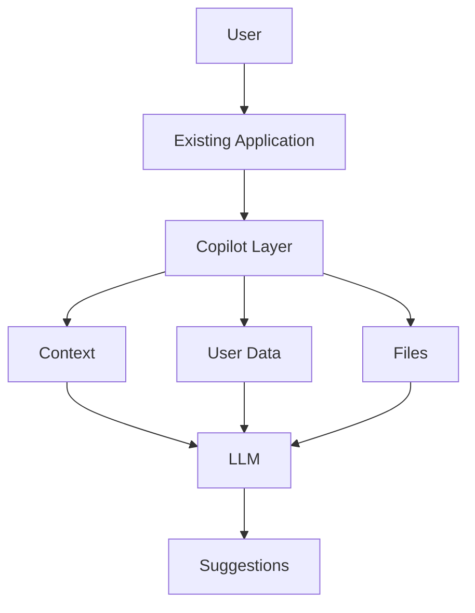
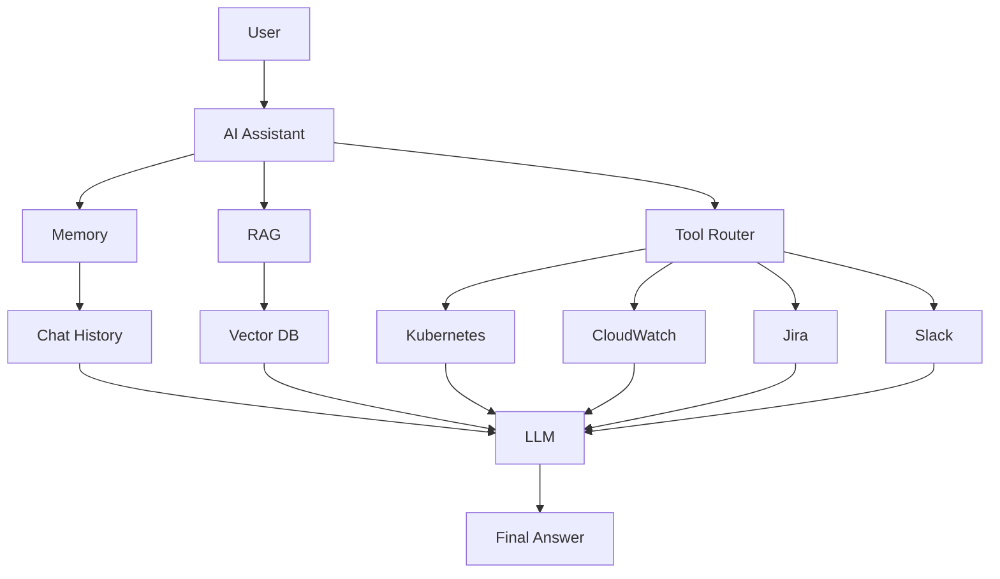

# LLM Apps Architecture: From Chat to AI Assistant

Many people assume this:

ChatGPT = Copilot = AI Assistant

They are not the same.

The better way to explain this is as an evolution:

The intelligence layer (the LLM) may stay similar, but the surrounding architecture becomes more capable with orchestration, retrieval, tools, memory, and governance.

## 1. LLM Application Architecture

This is the foundation: an application that sends a prompt and gets a response.

### Architecture

### Components

| Component | Responsibility |
| --- | --- |
| UI | Accept user input |
| Backend | Business logic |
| Prompt Builder | Build prompts |
| LLM | Generate response |
| Response Parser | Format response |

### Examples

- Chat app
- Translation app
- Email generator
- SQL generator
- Blog writer

### Key Point

No memory, no tools, no RAG.

Flow: Prompt -> LLM -> Response

### Enterprise LLM Application

In production, teams add layers around the LLM instead of exposing the model directly.

Common additions include authentication, guardrails, observability, prompt management, and monitoring.

## 2. Chat Application Architecture

Now the application becomes conversational.

The model still does not remember automatically, so the application must keep and resend chat history.

### Architecture

### New Components

| Component | Why Needed |
| --- | --- |
| Conversation Manager | Maintains chat state |
| Messages | Carries previous context |
| Session | Keeps per-user conversation |
| Memory | Enables multi-turn chat |

### Conversation Flow

User -> Assistant -> User -> Assistant -> User -> Assistant

## 3. Copilot Architecture

A copilot does not just answer. It helps complete tasks inside another application.

Examples:

- GitHub Copilot
- Microsoft 365 Copilot
- Salesforce Copilot

### Architecture

### Components

| Component | Purpose |
| --- | --- |
| Host Application | IDE, Office, CRM |
| Context | Current page, file, or state |
| User Data | Emails, docs, business data |
| LLM | Generates suggestions |
| UI Panel | Copilot sidebar or assistant pane |

### Example Flow (Coding)

VS Code -> Current file -> Selected function -> Cursor position -> LLM -> Suggested code

### Chat vs Copilot

- Chat: User -> LLM -> Answer
- Copilot: User -> Current context -> LLM -> Suggestion -> Continue working

A copilot is context-aware and task-embedded.

## 4. AI Assistant Architecture

This is the most capable stage.

An AI assistant can:

- Remember
- Retrieve knowledge
- Call tools
- Route tasks
- Work with enterprise systems

### Architecture

### Components

| Component | Responsibility |
| --- | --- |
| Memory | Conversation continuity |
| RAG | Enterprise knowledge retrieval |
| Tool Calling | Executes real actions and checks |
| Prompt Builder | Builds grounded context |
| LLM | Reasoning |
| Response Layer | Final, actionable answer |

### Example

User asks: Why is my application slow?

The assistant orchestration flow can be:

Question -> Check memory -> Search knowledge base -> Call Kubernetes tool -> Check CloudWatch -> Build prompt -> LLM -> Final response

The LLM reasons; the application orchestrates.

## Final Evolution Summary

1. Level 1: LLM Application
User -> LLM -> Answer
2. Level 2: Chat Application
User -> Conversation history -> LLM -> Answer
3. Level 3: Copilot
User -> Current context -> LLM -> Suggestion
4. Level 4: AI Assistant
User -> Memory + Tools + RAG -> LLM -> Actionable response