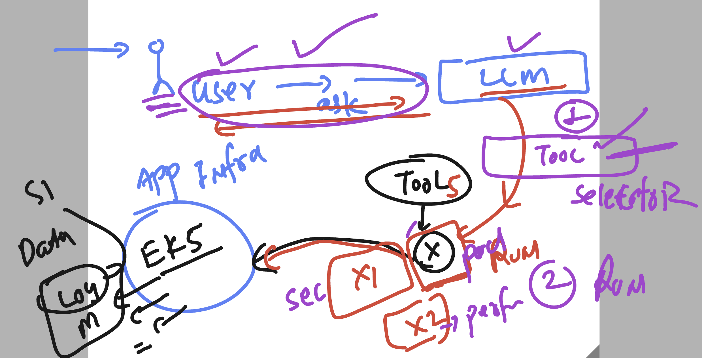

# Roche-SRE_AIOPS_EU_20thjuly2026

## chat app flask directory structure 

```
tree  ashu-ui-app/
ashu-ui-app/
├── app.py
├── requirements.txt
└── templates
    └── index.html


```

### Installing python modules using file 

```
 pip3 install -r requirements.txt 
```

### LLM copilot app with tools 



### checking aws / eks / kubectl related details

```
(ashu-roche-env) [ec2-user@ip-172-31-27-32 ~]$ aws  s3  ls
2026-04-27 13:28:42 ashutoshh-tf-test-bucket
2026-05-26 04:18:17 cf-templates-p5tewb2jg6i-ap-south-1
2026-04-22 03:17:02 delvex-software-center
2026-06-25 04:35:10 demobucketdatahub
(ashu-roche-env) [ec2-user@ip-172-31-27-32 ~]$ eksctl  get cluster --region us-east-1
NAME		REGION		EKSCTL CREATED
my-cluster	us-east-1	True
(ashu-roche-env) [ec2-user@ip-172-31-27-32 ~]$ 
(ashu-roche-env) [ec2-user@ip-172-31-27-32 ~]$ 
(ashu-roche-env) [ec2-user@ip-172-31-27-32 ~]$ kubectl version --client 
Client Version: v1.34.6-eks-bbe087e
Kustomize Version: v5.7.1
(ashu-roche-env) [ec2-user@ip-172-31-27-32 ~]$ 

===>


 aws eks update-kubeconfig --name my-cluster --region us-east-1
Added new context arn:aws:eks:us-east-1:992382386705:cluster/my-cluster to /home/ec2-user/.kube/config
(ashu-roche-env) [ec2-user@ip-172-31-27-32 ~]$ 
(ashu-roche-env) [ec2-user@ip-172-31-27-32 ~]$ 
(ashu-roche-env) [ec2-user@ip-172-31-27-32 ~]$ 
(ashu-roche-env) [ec2-user@ip-172-31-27-32 ~]$ kubectl  get nodes
NAME                             STATUS   ROLES    AGE    VERSION
ip-192-168-16-10.ec2.internal    Ready    <none>   2d9h   v1.34.9-eks-8f14419
ip-192-168-18-127.ec2.internal   Ready    <none>   2d9h   v1.34.9-eks-8f14419
ip-192-168-54-163.ec2.internal   Ready    <none>   2d9h   v1.34.9-eks-8f14419
(ashu-roche-env) [ec2-user@ip-172-31-27-32 ~]$ 


```

### python lib to interact with system commands / env 

```
 python3
Python 3.13.14 (main, Jun 16 2026, 00:00:00) [GCC 11.5.0 20240719 (Red Hat 11.5.0-5)] on linux
Type "help", "copyright", "credits" or "license" for more information.
>>> 
>>> import  os,subprocess
>>> os.system("kubectl get po")
NAME                          READY   STATUS    RESTARTS   AGE
ashuwebapp-5c7fbfc64b-4hmk7   1/1     Running   0          20h
0
>>> dir(subprocess)
['CalledProcessError', 'CompletedProcess', 'DEVNULL', 'PIPE', 'Popen', 'STDOUT', 'SubprocessError', 'TimeoutExpired', '_HAVE_POSIX_SPAWN_CLOSEFROM', '_PIPE_BUF', '_PopenSelector', '_USE_POSIX_SPAWN', '_USE_VFORK', '__all__', '__builtins__', '__cached__', '__doc__', '__file__', '__loader__', '__name__', '__package__', '__spec__', '_active', '_args_from_interpreter_flags', '_can_fork_exec', '_cleanup', '_del_safe', '_fork_exec', '_mswindows', '_optim_args_from_interpreter_flags', '_text_encoding', '_time', '_use_posix_spawn', 'builtins', 'call', 'check_call', 'check_output', 'contextlib', 'errno', 'fcntl', 'getoutput', 'getstatusoutput', 'io', 'list2cmdline', 'locale', 'os', 'run', 'select', 'selectors', 'signal', 'sys', 'threading', 'time', 'types', 'warnings']
>>> subprocess.getoutput('kubectl get po')
'NAME                          READY   STATUS    RESTARTS   AGE\nashuwebapp-5c7fbfc64b-4hmk7   1/1     Running   0          20h'
>>> 

```
