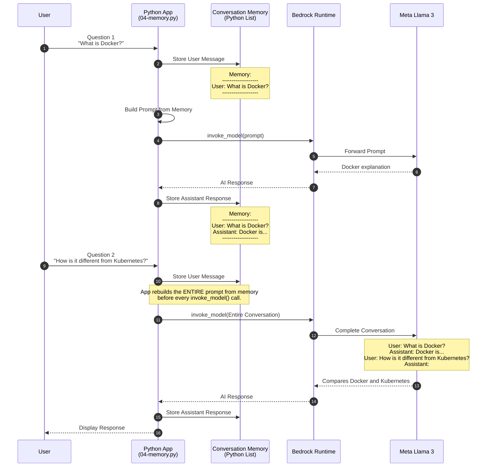

# How Memory Works

The LLM has no built-in memory between `invoke_model()` calls. Your application maintains the conversation history and resends it with every new request. This is the same multi-turn prompt pattern documented for Meta Llama on Amazon Bedrock.

## Mermaid Diagram




## What Actually Gets Sent to Bedrock

### First Question

```text
User:
What is Docker?

Assistant:
```

Then:

```text
invoke_model()
```

LLM responds.

### Memory After First Question

```text
User:
What is Docker?

Assistant:
Docker is a containerization platform...
```

### Second Question

Instead of sending only:

```text
How is it different from Kubernetes?
```

your application builds this prompt:

```text
<|begin_of_text|>

User:
What is Docker?

Assistant:
Docker is a containerization platform...

User:
How is it different from Kubernetes?

Assistant:
```

Then:

```text
invoke_model()
```

Meta Llama now understands:

- "it" = Docker
- previous answer
- previous context

This is the multi-turn conversation format recommended for Meta Llama prompts on Bedrock.

## Internal Application Flow

```text
Question 1
        │
        ▼
conversation.append()
        │
        ▼
Memory (Python List)
        │
        ▼
Build Full Prompt
        │
        ▼
invoke_model()
        │
        ▼
Meta Llama 3
        │
        ▼
AI Response
        │
        ▼
conversation.append()
        │
        ▼
Updated Memory
        │
──────────────────────────────────────

Question 2
        │
        ▼
Previous Memory + New Question
        │
        ▼
Build Full Prompt
        │
        ▼
invoke_model()
        │
        ▼
Meta Llama 3
```

## The Most Important Teaching Point

Every time you ask a new question, your Python application reconstructs the entire conversation from the conversation list and sends it again to Bedrock. The model does not remember previous requests by itself; your application provides the context on every call.

This concept becomes the foundation for understanding:

- Conversation Memory
- Chatbots
- Bedrock Converse API
- RAG, where retrieved documents are additional context
- AI Agents, where tool outputs are additional context

Once students understand this, the transition to RAG becomes very natural:

```text
Prompt sent to LLM

=

Conversation Memory
    +
Retrieved Documents (RAG)
    +
Tool Outputs
    +
Current User Question
```