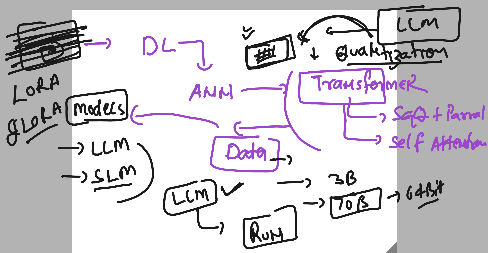
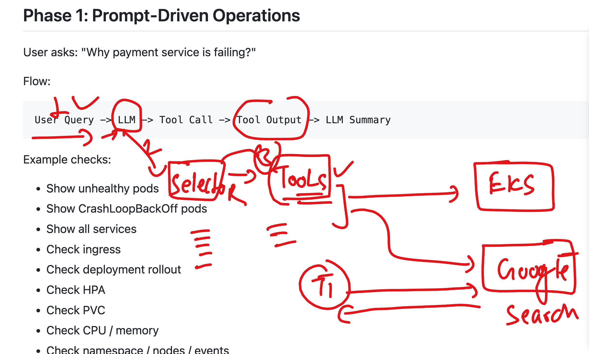

# Roche-SRE_AIOPS_EU_20thjuly2026

### Understanding about Model quantization 



### Understanding our APplication Model and workflow 



## llm-copilot-model project structure 

```
ashu-roche-env) [ec2-user@ip-172-31-27-32 ashu-roche-codes]$ mkdir llm-copilot-roche-app
(ashu-roche-env) [ec2-user@ip-172-31-27-32 ashu-roche-codes]$ ls
ashu-ui-app              bedrock-converse.py  llm-copilot-roche-app  model_inference.py  nova-chat.py   test-aws-bedrock.py
bedrock-converse-mem.py  invoke.py            llm_chat.py            my-chat-app         nova_model.py  tools
(ashu-roche-env) [ec2-user@ip-172-31-27-32 ashu-roche-codes]$ 
(ashu-roche-env) [ec2-user@ip-172-31-27-32 ashu-roche-codes]$ 
(ashu-roche-env) [ec2-user@ip-172-31-27-32 ashu-roche-codes]$ mv  tools/  llm-copilot-roche-app/
(ashu-roche-env) [ec2-user@ip-172-31-27-32 ashu-roche-codes]$ 
(ashu-roche-env) [ec2-user@ip-172-31-27-32 ashu-roche-codes]$ 
(ashu-roche-env) [ec2-user@ip-172-31-27-32 ashu-roche-codes]$ touch  llm-copilot-roche-app/start-calling.py 
(ashu-roche-env) [ec2-user@ip-172-31-27-32 ashu-roche-codes]$ tree  llm-copilot-roche-app/
llm-copilot-roche-app/
├── start-calling.py
└── tools
    ├── get_pods_details.py
    └── tool_selector.py


```
### test tool as well

```
ashu-roche-env) [ec2-user@ip-172-31-27-32 ashu-roche-codes]$ cd llm-copilot-roche-app/
(ashu-roche-env) [ec2-user@ip-172-31-27-32 llm-copilot-roche-app]$ ls
start-calling.py  tools
(ashu-roche-env) [ec2-user@ip-172-31-27-32 llm-copilot-roche-app]$ python3 start-calling.py 

Ask : can you create pod with nginx image from docker hub 

LLM Response : NO_TOOL

Selected Tool : NO_TOOL

No suitable tool is available for this request.
(ashu-roche-env) [ec2-user@ip-172-31-27-32 llm-copilot-roche-app]$ python3 start-calling.py 

Ask : show me runnings pods 

LLM Response : get_all_pods

Selected Tool : get_all_pods

Tool Output

[{'namespace': 'datadog', 'name': 'datadog-agent-4rnkz', 'status': 'Running'}, {'namespace': 'datadog', 'name': 'datadog-agent-7vsqr', 'status': 'Running'}, {'namespace': 'datadog', 'name': 'datadog-agent-wj4br', 'status': 'Running'}, {'namespace': 'datadog', 'name': 'datadog-cluster-agent-7f4b5f6785-7v2p4', 'status': 'Running'}, {'namespace': 'datadog', 'name': 'datadog-operator-b8d85c74f-dql24', 'status': 'Running'}, {'namespace': 'default', 'name': 'ashuwebapp-5c7fbfc64b-4hmk7', 'status': 'Running'}, {'namespace': 'kube-system', 'name': 'aws-node-gvsnl', 'status': 'Running'}, {'namespace': 'kube-system', 'name': 'aws-node-jwdk6', 'status': 'Running'}, {'namespace': 'kube-system', 'name': 'aws-node-wbj88', 'status': 'Running'}, {'namespace': 'kube-system', 'name': 'coredns-6976d5bf49-9j7ft', 'status': 'Running'}, {'namespace': 'kube-system', 'name': 'coredns-6976d5bf49-clsvh', 'status': 'Running'}, {'namespace': 'kube-system', 'name': 'kube-proxy-d4mtg', 'status': 'Running'}, {'namespace': 'kube-system', 'name': 'kube-proxy-q8549', 'status': 'Running'}, {'namespace': 'kube-system', 'name': 'kube-proxy-xq4p8', 'status': 'Running'}, {'namespace': 'kube-system', 'name': 'metrics-server-774f4c6dff-mwm7c', 'status': 'Running'}, {'namespace': 'kube-system', 'name': 'metrics-server-774f4c6dff-pvh5p', 'status': 'Running'}]

```
