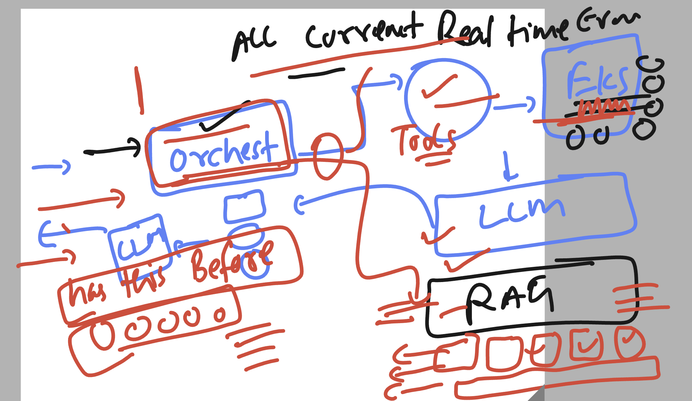
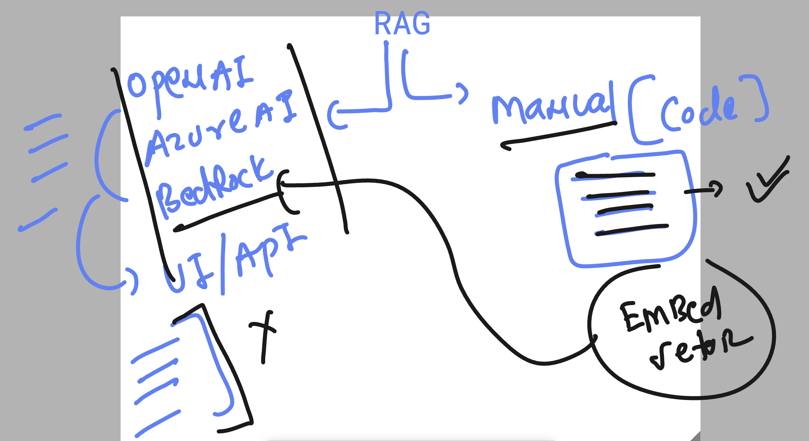

# Roche-SRE_AIOPS_EU_20thjuly2026

## More info about bedrock layer 


## Understanding LLM model tool / app security concerns 


## ORchestrator with realtime info + RAG 



## RAG process Understanding 



### making directory structure 

```
ec2-user@ip-172-31-27-32 ashu-roche-codes]$ mkdir  RAG
[ec2-user@ip-172-31-27-32 ashu-roche-codes]$ touch  RAG/loader.py
[ec2-user@ip-172-31-27-32 ashu-roche-codes]$ 
[ec2-user@ip-172-31-27-32 ashu-roche-codes]$ cp -rf  /tmp/knowledge/  RAG/
[ec2-user@ip-172-31-27-32 ashu-roche-codes]$ 
[ec2-user@ip-172-31-27-32 ashu-roche-codes]$ ls RAG/
knowledge  loader.py
[ec2-user@ip-172-31-27-32 ashu-roche-codes]$ 


```
### installing yaml / bs4 

```
pip3 install pyyaml  bs4
```