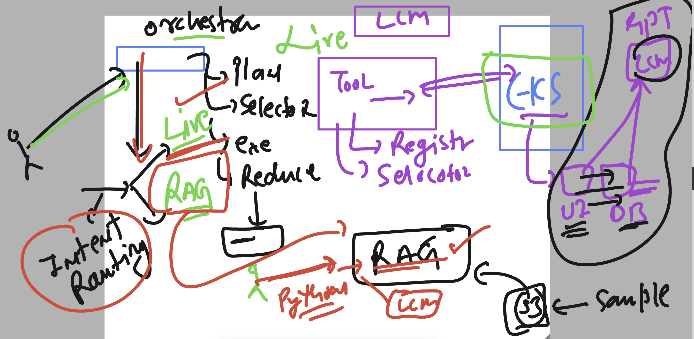

### Revision 


## Installing Goose CLI 

```
[ec2-user@ip-172-31-27-32 ~]$ curl -fsSL https://github.com/aaif-goose/goose/releases/download/stable/download_cli.sh | CONFIGURE=false bash
WINDIR: <not set>
OSTYPE: linux-gnu
uname -s: Linux
uname -m: x86_64
PWD: /home/ec2-user
Detected OS: linux with ARCH x86_64
Downloading stable release: goose-x86_64-unknown-linux-gnu.tar.bz2...
Extracting goose-x86_64-unknown-linux-gnu.tar.bz2 to temporary directory...
Creating directory: /home/ec2-user/.local/bin
Moving goose to /home/ec2-user/.local/bin/goose
Skipping 'goose configure', you may need to run this manually later
[ec2-user@ip-172-31-27-32 ~]$ goose  --version 
 1.45.0
[ec2-user@ip-172-31-27-32 ~]$ 


## updates
```

### check info 

```
[ec2-user@ip-172-31-27-32 ~]$ goose info 
goose Version:
  Version:                  1.45.0

Paths:
Config dir:              /home/ec2-user/.config/goose                              missing (can create)
Config yaml:             /home/ec2-user/.config/goose/config.yaml                  missing (can create)
Sessions DB (sqlite):    /home/ec2-user/.local/share/goose/sessions/sessions.db    missing (can create)
Logs dir:                /home/ec2-user/.local/state/goose/logs                    
[ec2-user@ip-172-31-27-32 ~]$ 

```
### configure Goose 

```
c2-user@ip-172-31-27-32 ~]$ goose configure 

Welcome to goose! Let's get you set up.
  you can rerun this command later to update your configuration


Help improve goose

Would you like to help improve goose by sharing anonymous usage data?
This helps us understand how goose is used and identify areas for improvement.

What we collect:
  • Operating system, version, and architecture
  • goose version and install method
  • Provider and model used
  • Extensions and tool usage counts (names only)
  • Session metrics (duration, interaction count, token usage)
  • Error types (e.g., "rate_limit", "auth" - no details)

We never collect your conversations, code, tool arguments, error messages,
or any personal data. You can change this anytime with 'goose configure'.

◇  Share anonymous usage data to help improve goose?
│  No 
│
●  Telemetry disabled. You can enable it anytime in settings.
│  

┌   goose-configure 
│
◇  How would you like to set up your provider?
│  Manual Configuration 
│
◇  Which model provider should we use?
│  Search all providers... 
│
◇  Search model providers
│  openai
│
◇  Which model provider should we use?
│  OpenAI 
│
◇  Would you like to set OPENAI_API_KEY? (optional)
│  Yes 
│
◇  Enter value for OPENAI_API_KEY
│  ▪▪▪▪▪▪▪▪▪▪▪▪▪▪▪▪▪▪▪▪▪▪▪▪▪▪▪▪▪▪▪▪▪▪▪▪▪▪▪▪▪▪▪▪▪▪▪▪▪▪▪▪▪▪▪▪▪▪▪▪▪▪▪▪▪▪▪▪▪▪▪▪▪▪▪▪▪▪▪▪▪▪▪▪▪▪▪▪▪▪▪▪▪▪▪▪▪▪▪▪▪▪▪▪▪▪▪▪▪▪▪▪▪▪▪▪▪▪▪▪▪▪▪▪▪▪▪▪▪▪▪▪▪▪▪▪▪▪▪▪▪▪▪▪▪▪▪▪▪▪▪▪▪▪▪▪▪▪▪▪▪▪▪▪
│
◇  Would you like to configure advanced settings?
│  No 
│
◇  Model fetch complete                                                                                                                     │                                                                                                                                           ◆  Select a model:
│  ● Search all models... (Search complete model list)
│  ○ gpt-4o 
│  ○ gpt-4o-mini 
│  ○ gpt-4.1 
◆  Select a model:
│  ○ Search all models... 

```
### checking it 

```
[ec2-user@ip-172-31-27-32 ~]$ goose info 
goose Version:
  Version:                  1.45.0

Paths:
Config dir:              /home/ec2-user/.config/goose                              
Config yaml:             /home/ec2-user/.config/goose/config.yaml                  
Sessions DB (sqlite):    /home/ec2-user/.local/share/goose/sessions/sessions.db    
Logs dir:                /home/ec2-user/.local/state/goose/logs                    
[ec2-user@ip-172-31-27-32 ~]$ goose info -v

====>

goose run  -t  "Helloooo , how are u ?"

    __( O)>  ● new session · openai gpt-5.4-mini
   \____)    20260730_2 · /home/ec2-user
     L L     goose is ready
Hellooo 😄 I’m doing well — thanks for asking!  
How are *you* doing?

```


### Adjusting current project to USE RAG 



### app options 

```
(ashu-roche-env) [ec2-user@ip-172-31-27-32 project-orchestrator]$ ls
ai  investigator  rag
(ashu-roche-env) [ec2-user@ip-172-31-27-32 project-orchestrator]$ ls  ai/
__pycache__  final_response_summary.py  tool_result_summary.py  tools
(ashu-roche-env) [ec2-user@ip-172-31-27-32 project-orchestrator]$ 
(ashu-roche-env) [ec2-user@ip-172-31-27-32 project-orchestrator]$ ls  rag/
__init__.py  __pycache__  rag_chat_bedrock.py
(ashu-roche-env) [ec2-user@ip-172-31-27-32 project-orchestrator]$ 
(ashu-roche-env) [ec2-user@ip-172-31-27-32 project-orchestrator]$ ls  investigator/
__init__.py  __pycache__  executor.py  orchestrator.py  planner.py  planner_prompt.py  reducer.py  router.py  router_prompt.py
(ashu-roche-env) [ec2-user@ip-172-31-27-32 project-orchestrator]$ ls ai/tools/
__pycache__         all_nodes.py  all_services.py   get_cluster_events.py  get_pod_resource_usage.py  system_prompt.py  tool_selector.py
all_deployments.py  all_pods.py   describe_pods.py  get_pod_logs.py        get_unhealthy_pods.py      tool_registry.py
(ashu-roche-env) [ec2-user@ip-172-31-27-32 project-orchestrator]$ 


```