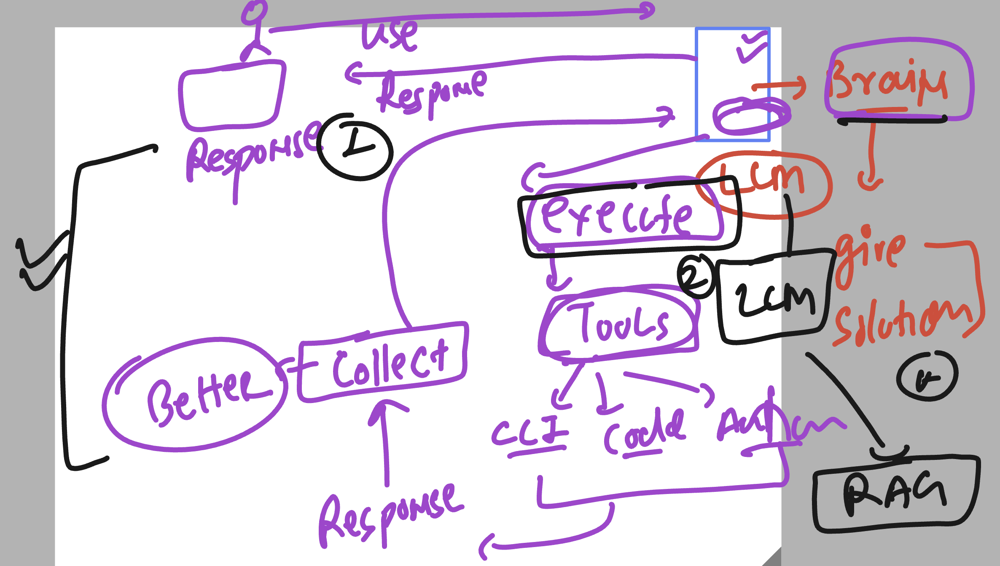

### Revision 



## Installing Goose CLI 

```
[ec2-user@ip-172-31-27-32 ~]$ curl -fsSL https://github.com/aaif-goose/goose/releases/download/stable/download_cli.sh | CONFIGURE=false bash
WINDIR: <not set>
OSTYPE: linux-gnu
uname -s: Linux
uname -m: x86_64
PWD: /home/ec2-user
Detected OS: linux with ARCH x86_64
Downloading stable release: goose-x86_64-unknown-linux-gnu.tar.bz2...
Extracting goose-x86_64-unknown-linux-gnu.tar.bz2 to temporary directory...
Creating directory: /home/ec2-user/.local/bin
Moving goose to /home/ec2-user/.local/bin/goose
Skipping 'goose configure', you may need to run this manually later
[ec2-user@ip-172-31-27-32 ~]$ goose  --version 
 1.45.0
[ec2-user@ip-172-31-27-32 ~]$ 


## updates
```
